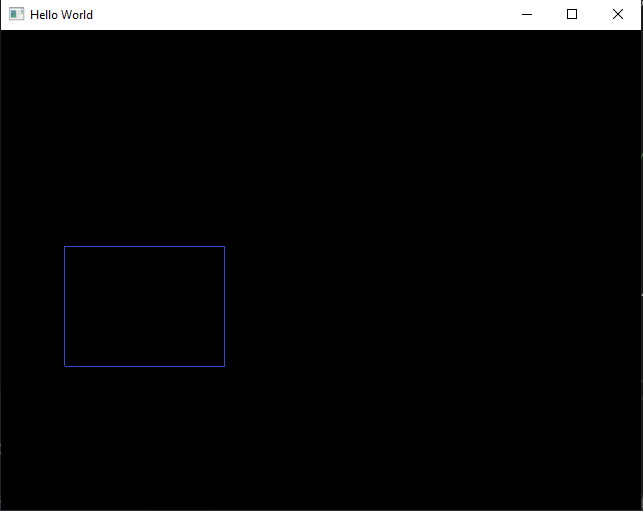

# CaveRenderer (0.1.5)
CaveRenderer is an Object Oriented rendering engine in C++ that I am working on to learn more about how low(er) level graphics / More specifically OpenGL works. My goal is to eventually create a 2D rendering engine to render multiple sprites and allow them to be moved. 

## Feature Set
The Current version (0.1.5) of the engine currently can do / has / is:
- Vertex Data Abstraction into DrawnObject and Layer. With DrawnObject representing a single shape drawn to the screen consisting of multiple Vertex Points and Layer being a list of one or many DrawnObjects.
- Renderer Object with a stage function allowing sending of a vertex buffer to the GPU, being either for a single object if a DrawnObject is passed or multiple Objects if a Layer is passed. 
- Work in Progress Abstraction of the Renderer which will handle OpenGL calls in such a way as to simplify creating large scenes with many objects. Currently the abstraction is not complete and might not make sense in some places. 
- Automatic generation of index data based on vertex data. Repeating vertices are referenced by a single index and are not redrawn (repeating vertices can still occur in a Layer context)
- Rendering of multiple DrawnObjects in a Layer (Without having to call glDraw for each one)
- A simple FPS Counter

p.s I am looking into a better format to highlight changes and dev updates. 

## Demo 
To Create an OpenGL Scene using the engine- Open up the Application.cpp file and scroll to the Data Setup Section. Due to the Renderer Object not being fully abstracted away there is quite a bit of code in the file for now. 

Create a Renderer Object and a Layer simply as
```
Renderer renderer; 
Layer Scene;
```
Create a DrawnObject to draw and pass in the number of vertices that make the Object.
```
DrawnObject Square(8)
```
Then since we are drawing a square we can use a vertex generator to convert arguments of x position, y position and a scale into vertex data as such
```
Square.SetSquareCordinates2D(-0.8f, -0.4f, 0.5f);
```
or just add vertex data directly with `SetPositions(float newPos[])` called on the object. Both ways will generate index data.

Then we add the DrawnObject to a Layer
```
Scene.AddObject(Square);
```
Then in the Buffers and Shaders Section (This will be changed later) we do `renderer.stage()` with an argument of a DrawnObject or a Layer which will be sent as a single vertex buffer to the GPU. ~~This should be the end and all that you need to do but currently you also need to manually call glDrawArrays in the While Loop.~~ This no longer need to be done, instead use `renderer.draw()` which figures out on it's own how many objects you've staged and handles index drawing.  

But Once that's all done you end up with a nice square (shaders are also a WIP) 


## Summary + Ref in creating this 
This code is quite simple so far but I am hoping to continue adding to it as I learn more about OpenGL. So far I have used the following resources which may come in handy to anyone who is also trying to learn OpenGL like me. 

1. Learnopengl.com. (2019). Learn OpenGL, extensive tutorial resource for learning Modern OpenGL. [online] Available at: https://learnopengl.com/.
2. www.opengl-tutorial.org. (n.d.). Home. [online] Available at: http://www.opengl-tutorial.org/ [Accessed 21 Aug. 2022].
3. www.youtube.com. (n.d.). Welcome to OpenGL. [online] Available at: https://www.youtube.com/watch?v=W3gAzLwfIP0 [Accessed 21 Aug. 2022].

‌
‌
‌


